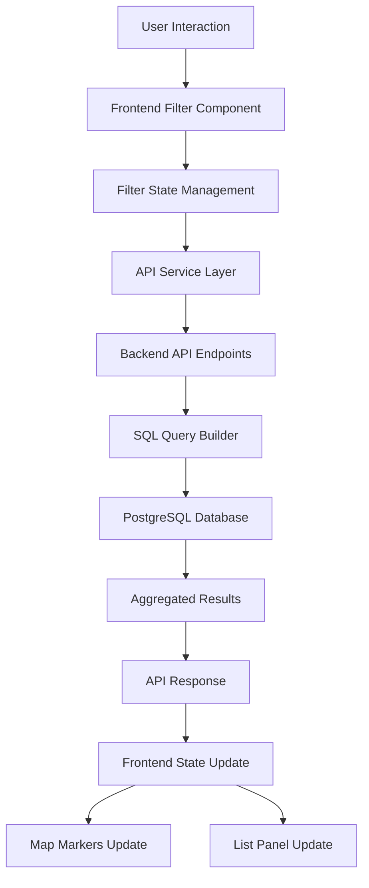

# Market Explorer 2.0 - System Architecture & Filter Logic

## Table of Contents
1. [Overview](#overview)
2. [System Components](#system-components)
3. [Data Flow Architecture](#data-flow-architecture)
4. [Filter System Architecture](#filter-system-architecture)
5. [Current Filter Behavior](#current-filter-behavior)
6. [Backend Services](#backend-services)
7. [Frontend Services](#frontend-services)
8. [Filter Interactions](#filter-interactions)
9. [Data Dependencies](#data-dependencies)
10. [Current Limitations](#current-limitations)

## Overview

Market Explorer 2.0 is a complex multi-layered application that visualizes healthcare claims data through an interactive map interface. The system allows users to explore Sites of Service, Healthcare Providers, and Provider Groups with various filtering capabilities.

### Key Concepts
- **Sites of Service**: Physical locations where healthcare is delivered (hospitals, clinics, etc.)
- **Providers**: Healthcare professionals who deliver care
- **Provider Groups**: Organizations that providers belong to
- **Visits**: Aggregated claim counts representing healthcare services delivered

## System Components

### 1. Database Layer (PostgreSQL)
```
claims_sites_of_service
├── id (UUID)
├── name, city, county, site_type
├── latitude, longitude
└── geomarket

claims_provider
├── id (UUID)
├── npi, name, specialty
├── provider_group
├── service_line
└── total_visits

claims_visits
├── id (UUID)
├── provider_id (FK)
├── site_id (FK)
├── visits (count)
└── has_oncology, has_surgery, has_inpatient
```

### 2. Backend API Layer (FastAPI)
- RESTful endpoints for data retrieval
- Filter application logic
- Aggregation queries
- Response formatting

### 3. Frontend Layer (React + TypeScript)
- Map visualization (Leaflet)
- Filter UI components
- View mode management
- Data display panels

## Data Flow Architecture



## Filter System Architecture

### Filter Categories

1. **Geographic Filters**
   - Geomarket (multi-select)
   - City (multi-select)
   - County (multi-select)
   - Bounding box (north, south, east, west)

2. **Site Filters**
   - Site Type (multi-select)
   - Minimum Site Visits
   - Has Coordinates (boolean)

3. **Provider Filters**
   - Specialty (multi-select)
   - Service Line (multi-select)
   - Minimum Provider Visits

4. **Provider Group Filters**
   - Provider Group (multi-select, searchable)
   - Minimum Group Visits
   - Minimum Sites per Group

5. **Service Type Filters**
   - Has Oncology (boolean)
   - Has Surgery (boolean)
   - Has Inpatient (boolean)

6. **Other Filters**
   - Search (text)
   - Quick View (site-specific filter)

### Filter Application Levels

1. **Global Filters**: Applied to all queries regardless of view mode
2. **Quick View Filter**: Overrides to show data for a specific site
3. **View Mode Context**: Determines which data is displayed in the list panel
4. **Map Filters**: Currently only uses site-based filters

## Current Filter Behavior

### Map Markers (Sites of Service)
**Endpoint**: `/api/claims/map-markers`

**Current Behavior**:
- Shows ALL sites that match geographic and site-type filters
- Aggregates total visits per site from ALL providers
- Does NOT filter by provider specialty or service line
- Does NOT filter by provider group

**Query Logic**:
```sql
SELECT site.*, SUM(visits.visits) as total_visits
FROM claims_sites_of_service site
LEFT JOIN claims_visits visits ON site.id = visits.site_id
WHERE [geographic and site filters]
GROUP BY site.id
```

### List Panel - Sites Mode
**Endpoint**: `/api/claims/sites`

**Current Behavior**:
- Shows sites matching all filters
- Visit counts are from ALL providers at each site
- Provider filters do NOT affect site listing

### List Panel - Providers Mode
**Endpoint**: `/api/claims/providers`

**Current Behavior**:
- Shows providers matching provider-specific filters
- Correctly filters by specialty, service line, provider group
- Visit counts are provider-specific totals

### List Panel - Groups Mode
**Endpoint**: `/api/claims/provider-groups`

**Current Behavior**:
- Shows aggregated provider group data
- Filters by specialty and geomarket
- Includes site count per group

## Current Endpoint Filter Usage

### `/api/claims/map-markers`
**Accepts**: 
- ✅ geomarket, city, site_type
- ✅ north, south, east, west (bounding box)
- ✅ min_site_visits
- ✅ has_oncology, has_surgery, has_inpatient
- ❌ specialty, service_line, provider_group
- ❌ min_provider_visits

**Query joins**: SiteOfService ← ClaimsVisit (NO provider join)

### `/api/claims/sites`
**Accepts**:
- ✅ geomarket, city, county, site_type
- ✅ min_site_visits
- ✅ has_coordinates
- ✅ search
- ❌ specialty, service_line, provider_group

**Query joins**: SiteOfService ← ClaimsVisit (NO provider join)

### `/api/claims/providers`
**Accepts**:
- ✅ geomarket
- ✅ specialty, service_line, provider_group
- ✅ min_provider_visits
- ✅ search
- ❌ site filters (site_type, city, county)

**Query**: ClaimsProvider table only (NO site join)

### `/api/claims/provider-groups`
**Accepts**:
- ✅ geomarket
- ✅ specialty
- ✅ min_group_visits, min_group_sites
- ✅ search
- ❌ service_line (not implemented)
- ❌ site filters

**Query joins**: ClaimsProvider ← ClaimsVisit (for site counting)

## Backend Services

### 1. Filter Application Service (`apply_filters`)
Located in: `/app/api/claims.py`

Applies filters to SQLAlchemy queries based on the model class:
- Geographic filters (applied to all models)
- Model-specific filters (specialty for providers, site_type for sites)
- Bounding box filters for coordinate-enabled models

### 2. Aggregation Services

#### Map Markers Aggregation
```python
# Aggregates ALL visits per site
query = session.query(
    SiteOfService,
    func.sum(ClaimsVisit.visits).label('total_visits'),
    func.count(distinct(ClaimsVisit.provider_id)).label('provider_count')
).outerjoin(ClaimsVisit)
```

#### Provider Groups Aggregation
```python
# Aggregates by provider group with site counting
query = session.query(
    ClaimsProvider.provider_group,
    func.count(distinct(ClaimsProvider.id)).label('provider_count'),
    func.count(distinct(ClaimsVisit.site_id)).label('site_count')
).outerjoin(ClaimsVisit)
```

### 3. Quick View Services
- `/sites/{site_id}/providers`: All providers at a specific site
- `/sites/{site_id}/provider-groups`: Provider groups at a specific site
- `/sites/{site_id}/site-details`: Single site details

## Frontend Services

### 1. Filter State Management
Located in: `/frontend/src/pages/MarketExplorer.tsx`

```typescript
const [filters, setFilters] = useState<ClaimsFilters>({});
const [quickViewSiteId, setQuickViewSiteId] = useState<string | null>(null);
```

### 2. Data Loading Logic
```typescript
// Always loads map markers (sites only)
const mapResponse = await claimsService.getMapMarkers(filters);

// Loads list data based on view mode
switch (viewMode) {
  case 'sites':
    // Loads sites with current filters
  case 'providers':
    // Loads providers with current filters
  case 'groups':
    // Loads provider groups with current filters
}
```

### 3. Filter Application Flow
1. User changes filter → `handleFiltersChange`
2. Updates local filter state
3. Triggers `useEffect` → `loadData`
4. Parallel API calls for map and list data
5. Updates both map markers and list panel

## Filter Interactions

### Current Disconnects

1. **Provider Filters → Map Markers**: NO EFFECT
   - Selecting specialty/service line doesn't change map dots
   - Map always shows total visits from all providers

2. **Provider Group Filters → Map Markers**: NO EFFECT
   - Selecting provider groups doesn't filter sites
   - No visual indication of which sites have selected groups

3. **Service Type Filters → Partial Effect**
   - Works for map markers (has_oncology, etc.)
   - Based on visit-level data, not provider attributes

### Connected Interactions

1. **Geographic Filters → Everything**: FULL EFFECT
   - Affects map markers, all list views
   - Properly cascades through all queries

2. **Site Type Filters → Sites**: FULL EFFECT
   - Properly filters both map and site listings
   - Does not affect provider listings (correct)

3. **Quick View → Context Switch**: FULL EFFECT
   - Overrides filters for selected site
   - Shows all providers/groups at that site

## Data Dependencies

### Visit Aggregation Logic

1. **Site Level**: Sum of all visits from all providers
2. **Provider Level**: Sum of visits for specific provider across all sites
3. **Group Level**: Sum of all visits from all providers in group

### Current Data Flow
```
Claims Data Import
    ↓
PostgreSQL Tables
    ↓
FastAPI Endpoints
    ├── Map Markers (Sites + Visit Aggregation)
    ├── Sites List (Sites + Visit Aggregation)
    ├── Providers List (Providers + Filters)
    └── Groups List (Groups + Aggregation)
    ↓
Frontend Display
    ├── Map (Always shows sites)
    └── List Panel (Shows based on view mode)
```

## Current Limitations

### 1. Filter Isolation
- Provider filters only affect provider view
- No cross-filtering between provider attributes and site display
- Map markers are effectively "read-only" to provider filters

### 2. Missing Aggregation Options
- Cannot see "sites with oncology providers"
- Cannot filter sites by "has providers in X specialty"
- Cannot see visit counts filtered by provider attributes

### 3. Visual Feedback Gaps
- No indication on map when provider filters are active
- No way to see which sites would have filtered providers
- Visit counts don't reflect active provider filters

### 4. Query Efficiency
- Separate queries for map and list data
- No shared aggregation between views
- Potential for inconsistent counts

## Visual Representation of Current Behavior

### Scenario: User selects "Oncology" specialty filter

```
Current Behavior:
┌─────────────────────────────────────────────────────────────┐
│ MAP VIEW                          │ LIST PANEL               │
├───────────────────────────────────┼──────────────────────────┤
│ • Hospital A (5,000 visits)       │ Providers Mode:          │
│   - Shows ALL visits              │ ✓ Dr. Smith (Oncology)   │
│   - Includes non-oncology         │ ✓ Dr. Jones (Oncology)   │
│                                   │                          │
│ • Clinic B (2,000 visits)         │ Sites Mode:              │
│   - Shows ALL visits              │ • Hospital A (5,000)     │
│   - No oncology indication        │ • Clinic B (2,000)       │
│                                   │ • Surgery Center (1,000) │
│ • Surgery Center (1,000 visits)   │   ^ Still shows all      │
│   - Shows ALL visits              │                          │
└───────────────────────────────────┴──────────────────────────┘

What User Might Expect:
┌─────────────────────────────────────────────────────────────┐
│ MAP VIEW                          │ LIST PANEL               │
├───────────────────────────────────┼──────────────────────────┤
│ • Hospital A (800 visits)         │ Providers Mode:          │
│   - Only oncology visits          │ ✓ Dr. Smith (Oncology)   │
│   - Smaller dot                   │ ✓ Dr. Jones (Oncology)   │
│                                   │                          │
│ • Clinic B (hidden or 0)          │ Sites Mode:              │
│   - No oncology providers         │ • Hospital A (800)       │
│                                   │   ^ Only oncology visits │
│ • Surgery Center (200 visits)     │ • Surgery Center (200)   │
│   - Only oncology visits          │                          │
└───────────────────────────────────┴──────────────────────────┘
```

### Data Flow Example

```
User Selects: Specialty = "Oncology"
                    ↓
┌─────────────────────────────────────────────────────────┐
│ Current Implementation                                   │
├─────────────────────────────────────────────────────────┤
│ Map Markers Query:                                      │
│ SELECT sites WHERE [geographic filters only]            │
│ → Returns ALL sites with ALL visits                    │
│                                                         │
│ Providers Query:                                        │
│ SELECT providers WHERE specialty = 'Oncology'           │
│ → Returns ONLY oncology providers                       │
│                                                         │
│ Result: Disconnected data views                         │
└─────────────────────────────────────────────────────────┘
```

## Potential Improvements

### Option 1: Provider-Aware Site Aggregation
Modify map marker query to respect provider filters:
```sql
SELECT site.*, SUM(visits.visits) as total_visits
FROM claims_sites_of_service site
JOIN claims_visits visits ON site.id = visits.site_id
JOIN claims_provider provider ON visits.provider_id = provider.id
WHERE [all filters including provider filters]
GROUP BY site.id
```

### Option 2: Dual-Mode Map Display
- Default: Show all visits (current behavior)
- Filtered: Show only visits from filtered providers
- Visual indicator for mode

### Option 3: Enhanced Site Metadata
Add computed fields:
- Sites with filtered provider count
- Sites with filtered visit count
- Percentage of filtered vs total visits

### Option 4: Filter Preview
Show impact of filters before applying:
- "This filter will show X sites with Y providers"
- "Z visits match your criteria"

## Recommended Approach

Based on the analysis, here's a recommended approach to make provider filters affect map markers:

### 1. Add Provider Filter Support to Map Endpoints

**Short-term Solution**: Add a toggle for "Filter map by selected providers"
- When OFF: Current behavior (show all visits)
- When ON: Only show visits from filtered providers

**Implementation**:
```python
# Modified map markers query
if apply_provider_filters:
    query = query.join(
        ClaimsProvider,
        ClaimsVisit.provider_id == ClaimsProvider.id
    )
    # Apply provider filters
    if filters.specialty:
        query = query.filter(ClaimsProvider.specialty.in_(filters.specialty))
```

### 2. Visual Indicators

Add visual feedback when provider filters are active:
- Different marker colors for filtered vs unfiltered
- Opacity changes for sites with no matching providers
- Badge showing "X of Y visits match filters"

### 3. Performance Considerations

The joined query (Sites ← Visits ← Providers) could be expensive. Consider:
- Caching filtered results
- Pre-computing provider-site relationships
- Using materialized views for common filter combinations

### 4. User Experience

Make the filtering behavior explicit:
- Add tooltip: "Showing visits from [filtered providers] only"
- Option to toggle between "All Visits" and "Filtered Visits"
- Clear indication when map is filtered

## Summary

The current architecture creates a disconnect between provider-level filters and site-level visualizations. While this may be intentional (to always show the complete picture of sites), it can be confusing when users expect provider filters to affect what they see on the map.

The key decision is whether the map should:
1. **Always show complete site data** (current behavior)
   - Pros: Complete market view, no hidden sites
   - Cons: Confusing when filters don't affect map

2. **Respect provider filters** (proposed change)
   - Pros: Consistent filtering across all views
   - Cons: May hide important sites, more complex queries

The architecture supports both approaches, and the choice depends on the primary use case for the Market Explorer tool.