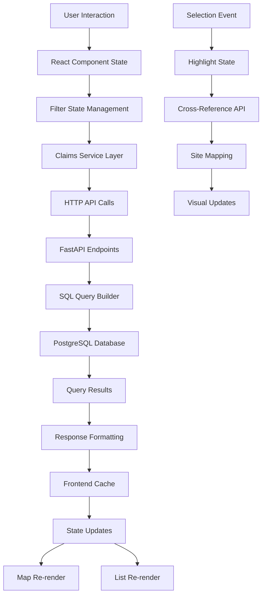

# Market Explorer 2.0 - System Architecture & Implementation Details

## Table of Contents
1. [Overview](#overview)
2. [System Components](#system-components)
3. [Data Flow Architecture](#data-flow-architecture)
4. [Filter System Architecture](#filter-system-architecture)
5. [Cross-Filtering Implementation](#cross-filtering-implementation)
6. [Map Visualization Architecture](#map-visualization-architecture)
7. [Backend Services](#backend-services)
8. [Frontend Services](#frontend-services)
9. [State Management](#state-management)
10. [Performance Optimizations](#performance-optimizations)
11. [Future Optimization Recommendations](#future-optimization-recommendations)

## Overview

Market Explorer 2.0 is a sophisticated healthcare claims data visualization platform that provides interactive map-based exploration of Sites of Service, Healthcare Providers, and Provider Groups. The system implements complex cross-filtering capabilities, visual highlighting, and multi-mode data views.

### Key Concepts
- **Sites of Service**: Physical healthcare delivery locations (hospitals, clinics, surgery centers)
- **Providers**: Healthcare professionals delivering care at sites
- **Provider Groups**: Organizations that providers belong to
- **Visits**: Aggregated claim counts representing healthcare services
- **Cross-Filtering**: Ability to filter sites by provider attributes and vice versa
- **Visual Highlighting**: Dynamic map visualization based on selections

## System Components

### 1. Database Layer (PostgreSQL)
```
claims_sites_of_service
├── id (UUID) - Primary key
├── legacy_id - Backward compatibility identifier
├── name, city, county, site_type
├── latitude, longitude - Geocoding data
├── geomarket - Market area designation
└── address, zip_code

claims_providers
├── id (UUID) - Primary key
├── npi - National Provider Identifier
├── name, specialty, specialty_grandparent
├── provider_group - Organization affiliation
├── service_line - Service category
├── top_payer, top_payer_percent
├── top_referring_org
├── top_sos_* - Primary site of service details
└── total_visits - Aggregated visit count

claims_visits
├── id (UUID) - Primary key
├── provider_id (FK) - Links to provider
├── site_id (FK) - Links to site
├── visits - Visit count for provider-site pair
└── has_oncology, has_surgery, has_inpatient - Service flags
```

### 2. Backend API Layer (FastAPI)
- RESTful endpoints with comprehensive filtering
- Cross-entity query capabilities
- Aggregation and statistical calculations
- Caching layer for performance

### 3. Frontend Layer (React + TypeScript)
- React Leaflet for map visualization
- Component-based architecture
- TypeScript for type safety
- Service layer for API communication

## Data Flow Architecture



## Filter System Architecture

### Filter Categories and Implementation

1. **Geographic Filters**
   - Geomarket, City, County (multi-select dropdowns)
   - Bounding box (north, south, east, west coordinates)
   - Applied across all entity types

2. **Site-Specific Filters**
   - Site Type (Hospital, Clinic, etc.)
   - Minimum Site Visits threshold
   - Minimum Providers at Site
   - Has Coordinates boolean

3. **Provider-Specific Filters**
   - Specialty (multi-select with hierarchy)
   - Service Line (categorized services)
   - Provider Group (searchable multi-select)
   - Minimum Provider Visits threshold

4. **Service Type Filters**
   - Has Oncology, Surgery, Inpatient (booleans)
   - Applied at visit level

5. **Context Filters**
   - Quick View (site-specific override)
   - Search text (cross-entity)

### Filter State Hierarchy

```
1. Quick View Mode (Highest Priority)
   └── Overrides all other filters for specific site context
   
2. Global Filters (Applied Everywhere)
   ├── Geographic boundaries
   ├── Search text
   └── Service type flags
   
3. Entity-Specific Filters
   ├── Sites: type, visit thresholds
   ├── Providers: specialty, group, service line
   └── Groups: visit and site thresholds
   
4. Visual Selection State
   └── Highlighting without filtering data
```

## Cross-Filtering Implementation

### Current Cross-Filter Matrix

| Endpoint | Site Filters | Provider Filters | Group Filters | Cross-Filter Support |
|----------|--------------|------------------|---------------|---------------------|
| /map-markers | ✅ Full | ✅ Full | ✅ Full | ✅ Complete |
| /sites | ✅ Full | ✅ Full | ✅ Full | ✅ Complete |
| /providers | ✅ Full | ✅ Full | ✅ Full | ✅ Complete |
| /provider-groups | ✅ Partial | ✅ Full | ✅ Full | ✅ Complete |

### Cross-Filtering SQL Implementation

```python
# Example: Map markers with provider filters
query = session.query(
    SiteOfService,
    func.sum(ClaimsVisit.visits).label('total_visits'),
    func.count(distinct(ClaimsVisit.provider_id)).label('provider_count')
).outerjoin(
    ClaimsVisit, SiteOfService.id == ClaimsVisit.site_id
).outerjoin(
    ClaimsProvider, ClaimsVisit.provider_id == ClaimsProvider.id
).group_by(SiteOfService.id)

# Apply cross-filters
if filters.specialty:
    query = query.filter(ClaimsProvider.specialty.in_(filters.specialty))
if filters.provider_group:
    query = query.filter(ClaimsProvider.provider_group.in_(filters.provider_group))
```

## Map Visualization Architecture

### Component Hierarchy
```
MarketExplorer (Main Container)
├── ClaimsFiltersComponent (Filter UI)
├── ClaimsMapSimple (Map Display)
│   ├── MapContainer (Leaflet)
│   ├── TileLayer (Base Map)
│   └── MemoizedCircleMarker[] (Site Markers)
│       ├── Popup (Site Details)
│       └── Event Handlers
└── ClaimsDataList (Right Panel)
    └── ViewMode-specific Components
```

### Visual Highlighting System

1. **State Management**
   ```typescript
   const [highlightedSiteIds, setHighlightedSiteIds] = useState<string[]>([]);
   const [highlightMode, setHighlightMode] = useState<'single' | 'multiple' | 'none'>('none');
   ```

2. **Highlight Triggers**
   - Provider selection → Fetch provider's sites → Highlight sites
   - Group selection → Fetch group's sites → Highlight multiple sites
   - Site selection → Highlight single site
   - Quick View → Override with single site highlight

3. **Visual Implementation**
   - Z-index sorting (highlighted markers render last)
   - Enhanced styling (larger radius, dark border, drop shadow)
   - Extreme transparency for non-highlighted markers
   - CSS classes for performance

### Performance Optimizations in Map Rendering

1. **React.memo for Marker Components**
   ```typescript
   const MemoizedCircleMarker = React.memo<MarkerProps>(
     ({ marker, isHighlighted, isInactive, ... }) => {
       // Stable path options using useMemo
       const pathOptions = useMemo(
         () => createPathOptions(marker, isHighlighted, isInactive),
         [marker.id, marker.total_visits, marker.site_type, isHighlighted, isInactive]
       );
       // ...
     }
   );
   ```

2. **CSS-based Animations Disabled**
   ```css
   .leaflet-interactive {
     transition: none !important;
   }
   ```

3. **Efficient State Calculations**
   - Set-based lookups for O(1) highlight checks
   - Memoized marker states
   - Stable callback references

## Backend Services

### 1. Filter Application Service
```python
def apply_filters(query, model_class, filters: ClaimsFilters):
    """Universal filter application with model awareness"""
    # Geographic filters (all models)
    if filters.geomarket:
        query = query.filter(model_class.geomarket.in_(filters.geomarket))
    
    # Model-specific filters
    if model_class == ClaimsProvider:
        if filters.specialty:
            query = query.filter(ClaimsProvider.specialty.in_(filters.specialty))
    elif model_class == SiteOfService:
        if filters.site_type:
            query = query.filter(SiteOfService.site_type.in_(filters.site_type))
    
    return query
```

### 2. Aggregation Services

```python
# Provider-aware site aggregation
def get_filtered_map_markers(filters: ClaimsFilters):
    base_query = session.query(SiteOfService)
    
    if has_provider_filters(filters):
        # Complex join for cross-filtering
        base_query = base_query.join(ClaimsVisit).join(ClaimsProvider)
        base_query = apply_provider_filters(base_query, filters)
    
    # Aggregate visits with filters applied
    return base_query.group_by(SiteOfService.id)
```

### 3. Site Mapping Endpoints

```python
@router.get("/providers/{provider_id}/sites")
async def get_provider_sites(provider_id: UUID):
    """Get all sites where a provider operates"""
    return session.query(
        SiteOfService.id,
        SiteOfService.name
    ).join(
        ClaimsVisit
    ).filter(
        ClaimsVisit.provider_id == provider_id
    ).distinct()

@router.get("/provider-groups/{group_name}/sites")
async def get_provider_group_sites(group_name: str):
    """Get all sites where a provider group operates"""
    # Similar implementation for groups
```

## Frontend Services

### 1. Claims Service Layer
```typescript
class ClaimsService {
  private cache = new Map<string, { data: any; timestamp: number }>();
  private cacheTimeout = 5 * 60 * 1000; // 5 minutes

  async getMapMarkers(filters?: ClaimsFilters): Promise<MapMarkersResponse> {
    return this.fetchWithCache<MapMarkersResponse>('/map-markers', filters);
  }

  async getProviderSites(providerId: string): Promise<{ id: string; name: string }[]> {
    return this.fetchWithCache(`/providers/${providerId}/sites`);
  }
}
```

### 2. State Synchronization
```typescript
// Highlight state management
const handleItemSelect = useCallback(async (itemId: string) => {
  if (quickViewSiteId) return; // Quick View takes precedence
  
  setSelectedId(itemId);
  
  switch (viewMode) {
    case 'providers':
      const sites = await claimsService.getProviderSites(itemId);
      setHighlightedSiteIds(sites.map(s => s.id));
      setHighlightMode(sites.length > 1 ? 'multiple' : 'single');
      break;
    // ... other cases
  }
}, [viewMode, quickViewSiteId]);
```

## State Management

### Component State Architecture
```
MarketExplorer (Container State)
├── filters: ClaimsFilters
├── viewMode: 'sites' | 'providers' | 'groups'
├── selectedId: string | undefined
├── highlightedSiteIds: string[]
├── highlightMode: 'single' | 'multiple' | 'none'
├── quickViewSiteId: string | null
└── loading states: { map: boolean, list: boolean }
```

### Data Flow Patterns

1. **Filter Changes**
   ```
   User Input → Filter Component → Parent State → API Calls → Update All Views
   ```

2. **Selection Changes**
   ```
   List Selection → Highlight Calculation → Map Update → Visual Feedback
   ```

3. **Quick View Flow**
   ```
   Map Popup Click → Quick View State → Filter Override → Focused Data Load
   ```

## Performance Optimizations

### 1. Frontend Caching
- 5-minute cache for API responses
- Cache key includes all filter parameters
- Manual cache clearing on refresh

### 2. Query Optimization
- Proper indexes on all foreign keys and filter columns
- Aggregation queries use GROUP BY efficiently
- LEFT JOIN for optional relationships

### 3. Rendering Optimization
- React.memo for expensive components
- useMemo for derived calculations
- useCallback for stable function references
- CSS-based styling instead of inline styles

### 4. Network Optimization
- Parallel API calls for map and list data
- Pagination support (though not fully implemented in UI)
- Minimal data transfer (only required fields)

## Future Optimization Recommendations

### 1. Backend Optimizations

#### a. Materialized Views
```sql
CREATE MATERIALIZED VIEW mv_site_provider_summary AS
SELECT 
    s.id as site_id,
    p.specialty,
    p.service_line,
    p.provider_group,
    COUNT(DISTINCT p.id) as provider_count,
    SUM(v.visits) as total_visits
FROM claims_sites_of_service s
JOIN claims_visits v ON s.id = v.site_id
JOIN claims_providers p ON v.provider_id = p.id
GROUP BY s.id, p.specialty, p.service_line, p.provider_group;

CREATE INDEX idx_mv_site_specialty ON mv_site_provider_summary(site_id, specialty);
```

#### b. Query Result Caching
```python
from functools import lru_cache
import hashlib

@lru_cache(maxsize=100)
def get_cached_map_markers(filter_hash: str):
    # Expensive query here
    pass

def get_map_markers(filters: ClaimsFilters):
    filter_hash = hashlib.md5(str(filters).encode()).hexdigest()
    return get_cached_map_markers(filter_hash)
```

#### c. Database Connection Pooling
```python
# Optimize connection pool settings
engine = create_engine(
    DATABASE_URL,
    pool_size=20,
    max_overflow=40,
    pool_pre_ping=True,
    pool_recycle=3600
)
```

### 2. Frontend Optimizations

#### a. Virtual Scrolling for Lists
```typescript
import { FixedSizeList } from 'react-window';

const VirtualizedProviderList = ({ providers }) => (
  <FixedSizeList
    height={600}
    itemCount={providers.length}
    itemSize={100}
    width="100%"
  >
    {({ index, style }) => (
      <div style={style}>
        <ProviderCard provider={providers[index]} />
      </div>
    )}
  </FixedSizeList>
);
```

#### b. Web Workers for Heavy Calculations
```typescript
// filterWorker.ts
self.addEventListener('message', (e) => {
  const { markers, highlightedIds } = e.data;
  
  const processed = markers.map(marker => ({
    ...marker,
    isHighlighted: highlightedIds.includes(marker.id)
  }));
  
  self.postMessage(processed);
});

// Usage in component
const processMarkersInWorker = (markers, highlightedIds) => {
  return new Promise((resolve) => {
    const worker = new Worker('/filterWorker.js');
    worker.postMessage({ markers, highlightedIds });
    worker.onmessage = (e) => resolve(e.data);
  });
};
```

#### c. Marker Clustering for Dense Areas
```typescript
import MarkerClusterGroup from 'react-leaflet-markercluster';

<MarkerClusterGroup
  chunkedLoading
  maxClusterRadius={50}
  spiderfyOnMaxZoom={true}
  showCoverageOnHover={false}
>
  {markers.map(marker => (
    <CircleMarker key={marker.id} {...markerProps} />
  ))}
</MarkerClusterGroup>
```

### 3. Architecture Improvements

#### a. GraphQL for Flexible Data Fetching
```graphql
query GetMapData($filters: FilterInput!) {
  sites(filters: $filters) {
    id
    name
    coordinates
    visits(filtered: true) {
      total
      bySpecialty {
        specialty
        count
      }
    }
    providers(onlyActive: true) {
      count
      topSpecialties
    }
  }
}
```

#### b. Real-time Updates with WebSockets
```typescript
// Real-time filter updates
const ws = new WebSocket('ws://localhost:8000/ws');

ws.onmessage = (event) => {
  const update = JSON.parse(event.data);
  if (update.type === 'FILTER_STATS') {
    setFilterStats(update.data);
  }
};
```

#### c. Progressive Web App Features
```typescript
// Service worker for offline caching
self.addEventListener('fetch', (event) => {
  if (event.request.url.includes('/api/claims/filter-options')) {
    event.respondWith(
      caches.match(event.request).then((response) => {
        return response || fetch(event.request).then((response) => {
          return caches.open('v1').then((cache) => {
            cache.put(event.request, response.clone());
            return response;
          });
        });
      })
    );
  }
});
```

### 4. Monitoring and Analytics

#### a. Performance Monitoring
```typescript
// Track render performance
const measureMapRender = () => {
  performance.mark('map-render-start');
  
  // After render
  performance.mark('map-render-end');
  performance.measure(
    'map-render',
    'map-render-start',
    'map-render-end'
  );
  
  const measure = performance.getEntriesByName('map-render')[0];
  analytics.track('map_render_time', { duration: measure.duration });
};
```

#### b. User Interaction Tracking
```typescript
// Track filter usage patterns
const trackFilterUsage = (filterType: string, values: any[]) => {
  analytics.track('filter_applied', {
    filter_type: filterType,
    value_count: values.length,
    timestamp: new Date().toISOString()
  });
};
```

### 5. Scalability Recommendations

1. **Horizontal Scaling**
   - Deploy multiple API instances behind load balancer
   - Use Redis for distributed caching
   - Implement database read replicas

2. **Data Partitioning**
   - Partition claims_visits by date range
   - Shard by geographic region for large datasets
   - Archive historical data

3. **CDN Integration**
   - Serve static assets from CDN
   - Cache API responses at edge locations
   - Implement geographic routing

4. **Batch Processing**
   - Pre-calculate common aggregations nightly
   - Generate heat maps for different filter combinations
   - Build summary statistics tables

## Conclusion

The Market Explorer 2.0 architecture successfully implements a complex healthcare data visualization system with sophisticated filtering and cross-referencing capabilities. The current implementation provides a solid foundation with good separation of concerns, type safety, and reasonable performance for moderate data volumes.

Key architectural strengths:
- Clean separation between data, business logic, and presentation layers
- Comprehensive cross-filtering capabilities
- Flexible and extensible filter system
- Performance optimizations for common use cases

Areas for future enhancement:
- Advanced caching strategies for large datasets
- Real-time collaboration features
- Machine learning-based insights
- Mobile-optimized experience

The recommended optimizations focus on maintaining the current architecture's strengths while preparing for scale and adding advanced features that enhance the user experience without compromising the system's maintainability.